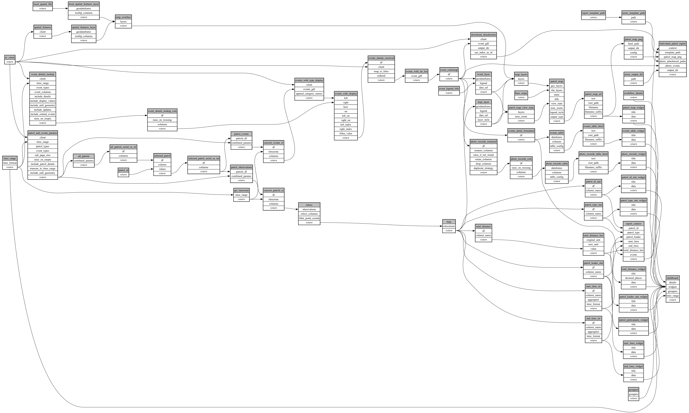

```
# AUTOGENERATED BY ECOSCOPE-WORKFLOWS; see fingerprint in README.md for details

```

```yaml
# fingerprint:
artifacts_sha256_basic: b67a5e9e30a5da8f1f660bd1b694995afc69bfe8c5c0514ad114e7a6b70f5e29
artifacts_sha256_strict: 4f3b3afeecf60a3f2f96070547577cb3fde99d9f983020d138d6f78f4f2a9d54
installed_requirements:
- channel: https://repo.prefix.dev/ecoscope-workflows/
  name: ecoscope-platform
  version: {version: ==2.23.0}
- channel: https://repo.prefix.dev/ecoscope-workflows-custom/
  name: ecoscope-workflows-ext-custom
  version: {version: ==0.1.1}
- channel: conda-forge
  name: pydeck
  version: {version: ==0.9.2}
- channel: file:///tmp/ecoscope-workflows-custom/release/artifacts/
  name: ecoscope-workflows-ext-icmbio
  version: {version: ==0.0.1}
params_sha256: 70a6528c031fc4adca9c3ff05189410482183459696629c36c15aa18e16cf0b7
spec_sha256: 3c1b4427ecb74173de22a9b974735a532d577d579343daed58bf4220234c3fd1

```

# ecoscope-workflows-individual-patrol-workflow


