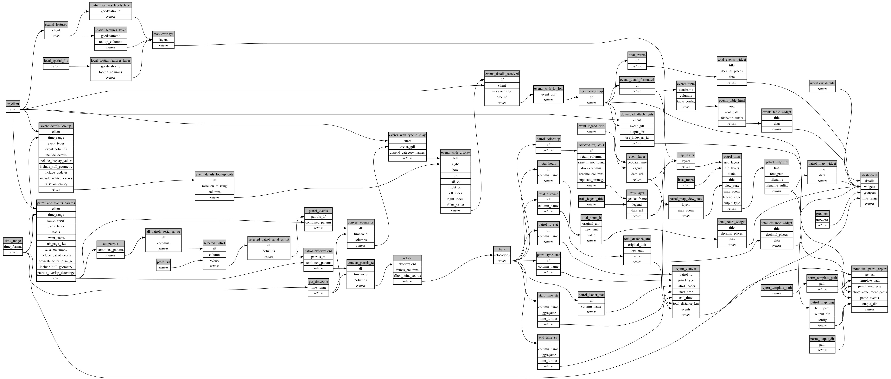

```
# AUTOGENERATED BY ECOSCOPE-WORKFLOWS; see fingerprint in README.md for details

```

```yaml
# fingerprint:
artifacts_sha256_basic: f99643ca8b530b4b021082ed718abd5f79a58d0784e04f2d913e4826e5d35755
artifacts_sha256_strict: 41e9a7db576bb7f574627743d6545e91e869c98d8dde5134fe25b7f32ebedb2c
installed_requirements:
- channel: https://repo.prefix.dev/ecoscope-workflows/
  name: ecoscope-platform
  version: {version: ==2.25.1}
- channel: https://repo.prefix.dev/ecoscope-workflows-custom/
  name: ecoscope-workflows-ext-custom
  version: {version: ==0.1.2}
- channel: conda-forge
  name: pydeck
  version: {version: ==0.9.2}
- channel: https://repo.prefix.dev/ecoscope-workflows-custom/
  name: ecoscope-workflows-ext-icmbio
  version: {version: ==0.0.6}
params_sha256: 15ce8ac2f4e9a1331158b27cadddf8ae3a29e82b6a6b5e7d6dda2a34218bc17e
spec_sha256: 8fb0c9da26175ac87f26d14f1c9d79f80a9ed3fd09361784d84773601613b8be

```

# ecoscope-workflows-individual-patrol-workflow


